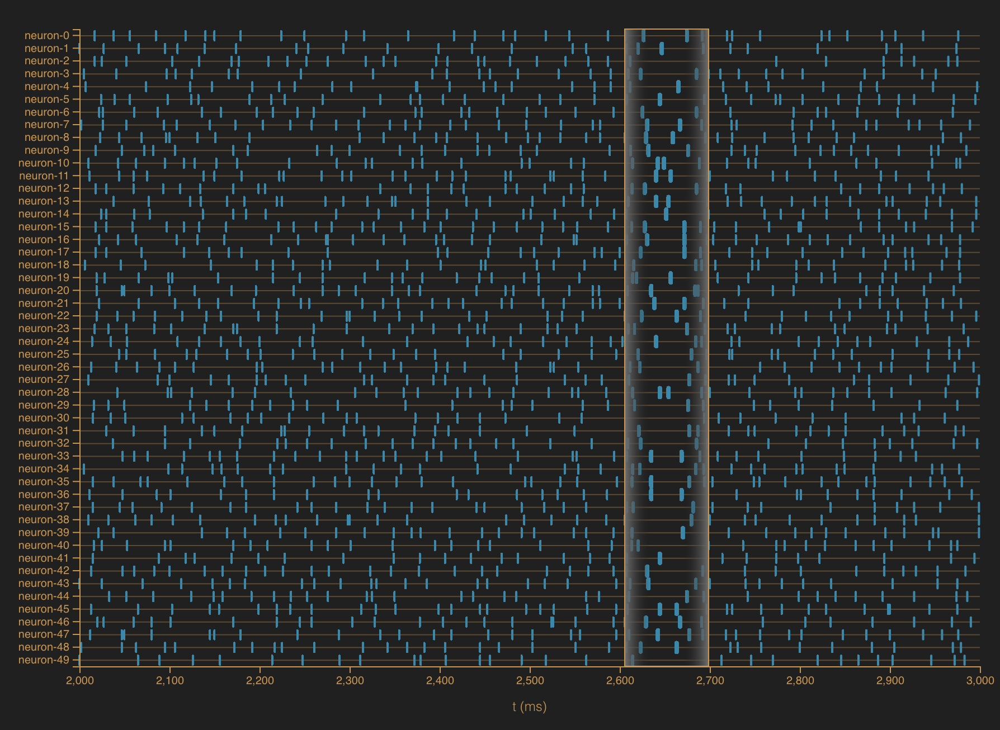
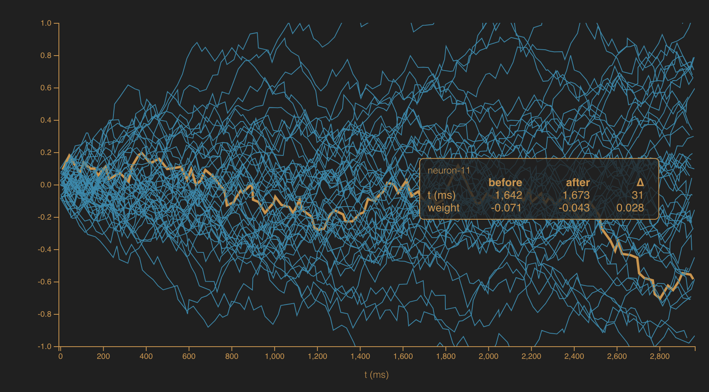
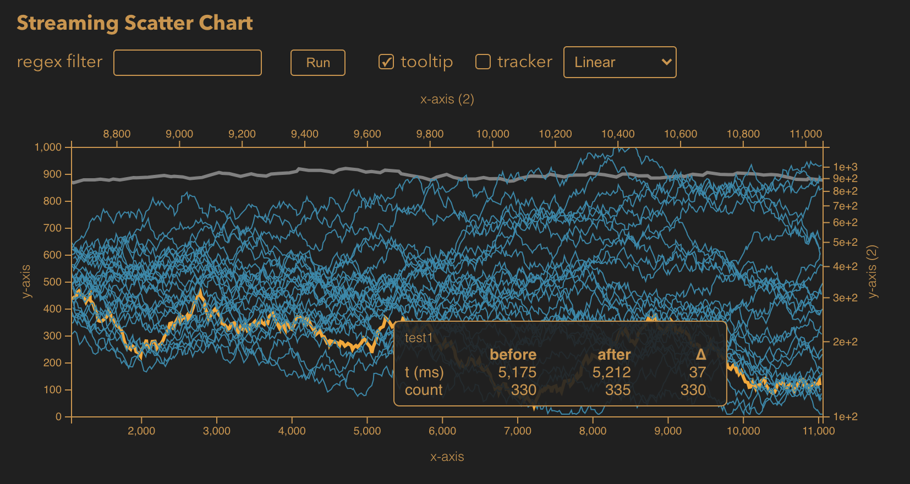

# stream-charts

`stream-charts` are [react](https://reactjs.org)-based time-series charts for viewing high frequency data, streamed in real-time using [rxjs](https://rxjs-dev.firebaseapp.com). Generally, update periods of 25 ms aren't a problem for about a hundred or so time-series. To achieve this type of performance, the charts are implemented in [d3](https://d3js.org) and wrapped in react functional components using hooks.

[Homepage](https://robphilipp.github.io/stream-charts/)

Although still under development, there are two charts available:
1. A neuron raster chart, and a
2. scatter chart.

Over time, I'll add additional chart types. In the meantime, I welcome any contributions to create new chart types (bar, gauges, etc).

Both charts provide
1. A tracker that shows the current time of the mouse position
2. A tooltip that gives information about the current datum
3. A magnifier that zooms in on the data giving a more detailed look.
4. A regular expression filter to remove time-series whose names don't match.
5. Themeable properties to change the look of the plots.
6. Zooming and panning.


Please see [change history](changes.md) for a history of changes.

## quick start

```
$ npm install stream-charts
```

For the neuron raster chart (see [example](src/app/examples/StreamingRasterChart.tsx))

```typescript
import RasterChart from "../charts/RasterChart";
.
.
.
<RasterChart
    width={plotWidth}
    height={seriesHeight}
    seriesList={seriesList}
    seriesObservable={observableRef.current}
    onSubscribe={subscription => subscriptionRef.current = subscription}
    onUpdateTime={(t: number) => {
        if(t > 1000) subscriptionRef.current!.unsubscribe()
    }}
    timeWindow={timeWindow}
    margin={{top: 30, right: 20, bottom: 30, left: 75}}
    tooltip={{visible: visibility.tooltip}}
    magnifier={{visible: visibility.magnifier, magnification: 5}}
    tracker={{visible: visibility.tracker}}
    filter={filter}
/>

```

and for the scatter chart  (see [example](src/app/examples/StreamingScatterChart.tsx))

```typescript
import ScatterChart from "../charts/ScatterChart";
.
.
.
<ScatterChart
    width={plotWidth}
    height={plotHeight}
    seriesList={seriesList}
    seriesObservable={observableRef.current}
    onSubscribe={subscription => subscriptionRef.current = subscription}
    onUpdateTime={(t: number) => {
        if(t > 1000) subscriptionRef.current!.unsubscribe()
    }}
    timeWindow={timeWindow}
    margin={{top: 30, right: 20, bottom: 30, left: 75}}
    tooltip={{visible: visibility.tooltip}}
    tooltipValueLabel='weight'
    magnifier={{visible: visibility.magnifier, magnification: magnification, radius: 150}}
    tracker={{visible: visibility.tracker}}
    filter={filter}
/>
```

## intro

`stream-charts` are high-performance charts for displaying large amounts of data in real-time. The charts are wrapped in [react](https://reactjs.org) and fed data using [rxjs](https://rxjs-dev.firebaseapp.com) `Observable`s. The goal `stream-charts` is to display large amounts of time-series data at high frequencies while providing tools to understand the time-series.

There are currently two chart types available: a raster chart for display neuron spikes as a function of time, and a scatter chart. The chart below shows the raster chart with the bar magnifier enabled. The controls at the top of the chart are part of the example. These controls allow filtering time-series by their assigned names in real-time, displaying a tooltip when the mouse pointer is on top of a datum, displaying a tracker that show a vertical line and the current time of the mouse, and a bar magnifier, as shown in the image.



A scatter plot is shown below. In this plot, the neurons' weights are plotted as a function of time. In this plot, the magnifier is enabled, and magnifies the data near the mouse pointer.

  

Another example of a scatter plot is shown below. In this plot, a tooltip shows the weight updates that came just before the mouse cursor and just after, as well as the time and weight changes.



In both cases the plots were updated in real-time with an average update time interval of 25 ms. 

## usage

### properties

The [examples](src/app/examples) directory has example code that was used to generate the charts in the images above. The [StreamingRasterChart](src/app/examples/StreamingRasterChart.tsx) provides an example of using the raster chart. The [StreamingScatterChart](src/app/examples/StreamingScatterChart.tsx) provides an example of using the scatter chart. Both of these examples provide controls for enabling the filtering, tooltip, tracker, and magnifier enhancements.

Each chart accepts a number of required and optional properties. The properties are divided into 
1. style, 
2. data, 
3. enhancements, and
4. state. 

#### styles

Except for the plot height and width, *style* properties are optional. Style properties define how the plot will look. For example, the *margin* property defines the space between the rectangle defined by the *height* and *width* property and the plot area. 

All the optional *style* properties have defaults (the defaults look like the example charts above). The defaults can be overridden by specifying the properties you would like to change. For example, if you would like to change only the size of the font used for the axes labels, then you can specify the property as,

```typescript
<ScatterChart
    .
    .
    .
    axisLabelFont={{color: 'blue'}}
    .
    .
    .
/>
``` 

In this case, the size, family, and weight of the axis labels will remain at their default values, and only the color will change from its default value to the one specified, which in this case is "blue".

The *style* properties common to all plots are listed in the table below.

| Name |  | Type | Description | Example |
| ---- | --- | -------- | ----------- | ------- |
| width | required | number | The width of the chart in pixels | 450 |
| height | required | number | The height of the chart in pixels | 300 |
| margin | optional | [Margin](src/app/charts/margins.ts) | The plot margin | `{top: 10, left: 10}` |
| axesLabelFont | optional | `{size: number, color: string, family: string, weight: number}` | The font used to display the labels for the axes and ticks | `{size: 14, color: '#fff'}` |
| backgroundColor | optional | string | The background color of the plot. Technically, this property is carried over to the SVG element holding the entire plot | `'#202020'` |

#### data

The *data* properties define the data source, processing, and constraints.

| Name |     | Type | Description | Example |
| ---- | --- | ---- | ----------- | ------- |
| seriesList | required | Array<[Series](src/app/charts/datumSeries.ts)> | A list of the series to plot. | `[seriesFrom('test1')]` |
| seriesObservable | required | [Observable](https://rxjs-dev.firebaseapp.com/api/index/class/Observable) <[ChartData](src/app/charts/chartData.ts)> | An [rxjs](https://rxjs-dev.firebaseapp.com) observable that sources chart data. | see the [randomWeightDataObservable(...)](src/app/examples/randomData.ts) function. |
| windowingTime | optional | number (ms) | Controls the update frequency of the chart. Depending on the number of time-series being plotted, this number can be comfortably set at 25 ms. The default value is 100 ms | `100` |
| timeWindow | required | number (ms) | The maximum time between the `minTime` and the `maxTime`. | `2000` |

##### Understanding the time-window.

These charts have been develop to be used with high-frequency dynamic data that my run for a considerable amount of time. For example, you may stream in data for a few hundred seconds, and have the plot show the last 10 seconds worth of data. To achieve this you use the `timeWindow` property. Because you want to see the most recent 10 seconds of data, you set the time-window property to 10,000 ms (`timeWindow={10000}`). The charts use the time-window property and the current simulation time to show the most recent `timeWindow` milliseconds of data (in our example, the past 10 seconds). This causes the data to "slide" to the left after `timeWindow` has elapsed.


#### enhancements

The tracker, tooltip, magnifier, and filter are enhancements to the plots for exploring the displayed data. Each of these enhancements has a set of properties for determining how they are displayed. The details of the styles are given in sections below. All enhancements are optional, and, inactive by default. 

The tracker, tooltip, and magnifier are activated (shown) when the mouse is in the plot area **and** the enhancement's `visible` property is set to true. Generally, only one enhancement is used at one time.

The filter enhancement differs from the others. This isn't a visible component, rather, it controls what data is displayed in the chart. The filter allows the user to specify a regular expression that is used to filter time-series based on their name. 

| Name |  | Type | Description | Example |
| ---- | --- | -------- | ----------- | ------- |
| tooltip | optional | [TooltipStyle](src/app/charts/TooltipStyle.ts) | Styling for the tooltip control when it is active | `{visible: false, fontSize: 12, fontColor: '#d2933f'}`|
| magnifier | optional | [RadialMagnifier](src/app/charts/ScatterChart.tsx) or [BarMagnifier](src/app/charts/RasterChart.tsx) | Defines the style of the radial magnifier used for the scatter chart and the bar magnifier used for the raster chart | `{visible: true}` |
| tracker | optional | [TrackerStyle](src/app/charts/TrackerStyle.ts) | Style of the tracker line that draws a vertical line at the time represented by the current mouse position and shows that time, when the mouse is in the plot area. | `{visible: false, timeWindow: 50}` |
| filter | optional | [RexExp](https://developer.mozilla.org/en-US/docs/Web/JavaScript/Reference/Global_Objects/RegExp) | A regular expression used to filter time-series based on their name. Generally, this would be specified by some control in the parent component. See for example [StreamingRasterChart](src/app/examples/StreamingRasterChart.tsx). | `^in[0-3]+$` | undefined | 


#### state

The *state* properties allow you to provide callbacks when the chart state changes. There are three state changes you can plug into
1. on subscription to the rxjs observable
2. when data changes
3. when the current time changes.

##### shouldSubscribe

> boolean

By default, when the charts mount, they subscribe to the specified observable. This causes the observable to start emitting chart-data. Although the chart controls the subscription to the observable, you can control the timing of that subscription through the `shouldSubscribe` property. Setting the property to `false` for the initial mount tells the chart not to subscribe when it mounts. Then, at some point in time later, when you want the chart to start consuming data, simply set the `shouldSubscribe` property to `true`. Once the chart has subscribed to the observable, changing the value of this property has no effect.

##### onSubscription

> (subscription: Subscription) => void

You hand the `stream-charts` an [Observable](https://rxjs-dev.firebaseapp.com/api/index/class/Observable). This defines how (i.e. the pipeline) the data is generated. Only upon subscription does data flow through this pipeline. The rxjs `Observable.subscribe(...)` function returns a [Subscription](https://rxjs-dev.firebaseapp.com/api/index/class/Subscription) that can be used to stop the data.

An example of an observable can be found in the [randomSpikeDataObservable(...)](src/app/examples/randomData.ts) function. 

One reason to provide an `onSubscription` callback is so that you have a handle on the subscription so that you can stop the data. For example, you may want to provide the user of your application a button to stop the data. Or, you may wish to stop the simulation after a certain period of time.

###### onUpdateData

> (seriesName: string, t: number, y: number) => void

When new data arrives from the observable, the `onUpdateData` callback provides a hook into the data. For example, you may want to stop the data if, for example, the value crosses some threshold.

If you are only interested in the current time, you can use the `onUpdateTime` callback.

##### onUpdateTime

> (time: number) => void

When the time associated with the data in the stream changes, this callback provides a hook into that time. In the [StreamingScatterChart](src/app/examples/StreamingScatterChart.tsx), for example, this callback is used to stop the random data after 1 second (1000 ms) by cancelling the subscription.

```typescript
<ScatterChart
    .
    .
    .
    onSubscribe={subscription => subscriptionRef.current = subscription}
    onUpdateTime={(t: number) => {
        if(t > 1000) subscriptionRef.current!.unsubscribe()
    }}
    .
    .
    .
/>
```

#### axisLabelFont

The axis-label font style is used as a `Partial<{size: number, color: string, family: string, weight: number}>`. This means you only need to specify the values of the style that you wish to change.

| Name | Type | Description | Example | Default Value |
| ---- | ---- | ----------- | ------- | ------- |
| size | number | The font size in pixels | `12` | 12 |
| color | string | The font color expressed as a string | `'rgba(25,25,25,0.3)'` | `'#d2933f'` |
| family | string | The font family | `'sans-serif'` | `'sans-serif'` |
| weight | number | The weight of the font | `350` | `300` |

#### tooltip 

The tooltip style is defined in the [TooltipStyle](src/app/charts/TooltipStyle.ts) interface. The `TooltipStyle` is used as a `Partial<TooltipStyle>`. This means that you only need to specify the values of the style that you wish to change. 

| Name | Type | Description | Example | Default Value |
| ---- | ---- | ----------- | ------- | ------- |
| visible | boolean | Whether on not the tooltip control is active and will show up on mouse-over. Generally this property will be controlled by the parent component in response to the selection of the control. See, for example, [`StreamingScatterChart`](src/app/examples/StreamingScatterChart.tsx). | `false` | `false` |
| fontSize | number | Size of the font in pixels | `12` | `12` |
| fontColor | string | Color of the font represented as a string | `'blue'` | `'#d2933f'` |
| fontFamily | string | Family of the font | `'"Avenir Next" sans-serif'` | `'sans-serif'` |
| fontWeight | number | Weight of the font represents its "thickness" | `300` | `250` |
| backgroundColor | string | The background color of the tooltip | `'green`' | `'#202020'` |
| backgroundOpacity | number | A number between 0 and 1 defining how opaque the background is. A value of 0 means that the background is completely transparent. A value of 1 means that the background is completely opaque. | `0.5` | `0.8` |
| borderColor | string | Color of the tooltip's border. | `'#f8ebc6'` | `'#d2933f'` |
| borderWidth | number | The width, in pixels, of the tooltip's border. | `3` | `1` |
| borderRadius | number | The radius, in pixels, of the rectangles "corners". A value of 0 is a sharp corner. A value of 5 means that the corner is replaced by a circle of radius 5 px. | `3` | `5` |
| paddingTop | number | The number of pixels between the top of the tooltip and the content. | `8` | `10` |   
| paddingRight | number | The number of pixels between the right side of the tooltip and the content. | `8` | `10` |   
| paddingLeft | number | The number of pixels between the left side of the tooltip and the content. | `8` | `10` |   
| paddingBottom | number | The number of pixels between the bottom of the tooltip and the content. | `8` | `10` |   

#### magnifier

Two types of magnifiers are used in `stream-charts`: a radial magnifier and a bar magnifier. The radial magnifier is used in the scatter chart, and the bar magnifier is used in the raster chart.

The radial magnifier style is defined in the [ScatterChart](src/app/charts/ScatterChart.tsx) component and is used as a `Partial<RadialMagnifierStyle>`, which means you only need to specify the values you wish to change.

| Name | Type | Description | Example | Default Value |
| ---- | ---- | ----------- | ------- | ------- |
| visible | boolean | Defines whether the magnifier is visible when the mouse is in the plot area. Generally, this would be managed by a control in the parent component. | `true` | `false` |
| radius | number | Radius, in pixels, of the magnifier lens displayed. | `125` | `100` |
| magnification | number | A value between 1 and 10 that defines the amount of magnification. A value of 1 mean almost no magnification. Generally, this value should be controlled by the parent component. | `4` | `5` |
| color | string | Lens axes and tick color. | `'purple'` | `'#d2933f'` |
| lineWidth | number | Width, in pixels, of the axes and ticks. | `1` | `2` |


The bar magnifier style is defined in the [RasterChart](src/app/charts/RasterChart.tsx) component and is used as a `Partial<LineMagnifierStyle>`, which means you only need to specify the values you wish to change.

| Name | Type | Description | Example | Default Value |
| ---- | ---- | ----------- | ------- | ------- |
| visible | boolean | Defines whether the magnifier is visible when the mouse is in the plot area. Generally, this would be managed by a control in the parent component. | `true` | `false` |
| width | number | Width, in pixels, of the bar-magnifier lens displayed. | `50` | `125` |
| magnification | number | A value between 1 and 10 that defines the amount of magnification. A value of 1 mean almost no magnification. Generally, this value should be controlled by the parent component. | `4` | `5` |
| color | string | Lens axes and tick color. | `'purple'` | `'#d2933f'` |
| lineWidth | number | Width, in pixels, of the axes and ticks. | `1` | `2` |
| axisOpacity | number | A number between 0 and 1 that defines how opaque the magnifier's axes are. A value of 0 means that the axes are completely transparent. A value of 1 means that the axes are completely opaque. | `0.5` | `0.35` |


#### tracker 

The tracker displays a vertical line in the chart area at the current mouse position, and show the time represented by that mouse position. The styles for the tracker determine how that line looks.

The tracker styles are defined in the [TrackerStyle](src/app/charts/TrackerStyle.ts) file and is used as a `Partial<TrackerStyle>`, which means that you only need to specify the values you would like to change.

| Name | Type | Description | Example | Default Value |
| ---- | ---- | ----------- | ------- | ------- |
| visible | boolean | Defines whether the tracker is visible when the mouse is in the plot area. Generally, this would be managed by a control in the parent component. | `true` | `false` |
| color | string | Color of the tracker line. | `'rgba(55,66,77,0.88)'` | `'#d2933f'` |
| lineWidth | number | Width, in pixels, of the vertical tracker line. | `2` | `1` | 

Please note that the font style of the tracker text is controlled by the axis-label font styles described above. 

### time-series


## running examples

Install the dependencies.

```
$ npm install
```

Run the development server, which should fire up a browser and load the example app.
```
$ npm start
```

##

This project was bootstrapped with [Create React App](https://github.com/facebook/create-react-app).